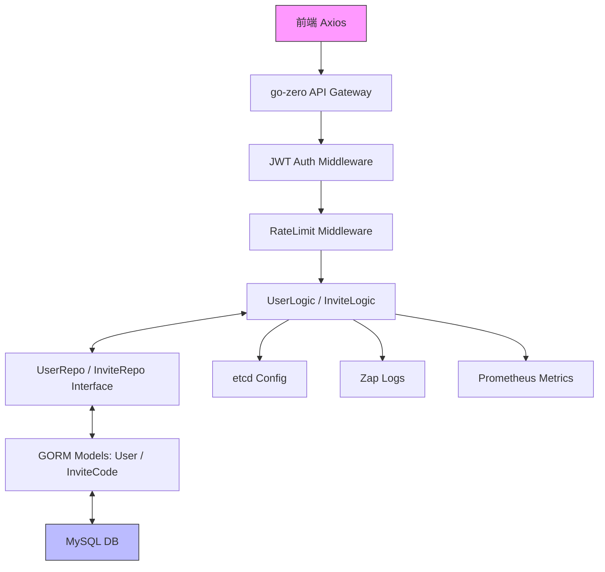

# 用户管理和邀请码管理模块技术设计文档

## 功能需求分析

### 用户故事
1. **注册**：作为潜在用户，我输入用户名/邮箱/手机号/密码/邀请码，系统验证邀请码有效（未用、未过期、启用）后创建账户（默认role='user', is_enabled=true），返回JWT令牌。故事ID: USR-001。
    - 子场景：重复用户名/邮箱/手机号提示“已存在”；无效邀请码提示“代码无效或已禁用”。
2. **登录**：作为用户，我输入邮箱/手机号/密码，系统验证后返回JWT令牌和Profile摘要（包含nickname、description）。故事ID: USR-002。
    - 子场景：密码错误增加failed_attempts（阈值5次后锁定）；guest角色无需密码（临时令牌）。
3. **Profile管理**：作为登录用户，我能查看/更新个人信息（nickname、description、lang_pref），系统同步is_enabled（admin操作）。故事ID: USR-003。
    - 子场景：admin可分页列表用户（过滤is_enabled=true），软删除用户（更新deleted_at）。
4. **邀请码生成**：作为admin，我指定数量生成唯一码（is_enabled=true，有效期30天）。故事ID: INV-001。
    - 子场景：批量生成（1-100），返回列表；admin可更新is_enabled=false禁用码。
5. **邀请码验证**：作为用户，在注册时输入码，系统检查有效性（未用、未过期、启用）。故事ID: INV-002。
    - 子场景：禁用码（is_enabled=false）返回无效；验证成功更新used_by并存储到user.invite_code。

### 核心流程
- 注册：输入表单 → 验证邀请码（Validate） → 哈希密码 → 插入user（invite_code=code） + 更新invite.used_by → 生成JWT。
- 登录：查询user by email/phone → 比对密码 → 生成JWT（payload含role、id）。
- 生成码：admin请求 → 循环BeforeCreate（生成code、ID、expires_at） → 批量插入。
- 验证码：查询by code → check used_by=null && expires_at>now && is_enabled=true。

### 边界条件
- 注册：密码<8字符（400）；guest角色仅临时会话（TTL=1h）。
- 登录：is_enabled=false用户禁用登录（403）。
- 邀请码：生成上限日1000；禁用后不可恢复（需admin重置）。
- 软删除：查询默认排除deleted_at非null；admin可Unscoped恢复。

## 架构设计

### 整体架构
采用go-zero框架MVC分层：api（handler/routes）→ logic（业务）→ repository（抽象DAL）→ gorm（MySQL模型）。Repository屏蔽存储（当前GORM，未来Redis/PgSQL）。JWT middleware验证role（admin/guest/user）。

### 方案要点
- **认证**：JWT HS256（payload: {id: UUID, role: enum}，TTL=7d）；guest角色无持久密码。
- **事务**：注册/验证用tx（Create user + Update invite）。
- **非功能**：响应<500ms（索引优化）；rate limit（注册5/min/IP）；软删除默认过滤。
- **扩展**：Repository接口支持多源；role='guest'用于匿名练习（无进度持久）。

## 数据设计

### MySQL表结构（InnoDB引擎）
- **users表**：
  | 字段 | 类型 | 约束 | 描述 |
  |------|------|------|------|
  | id | CHAR(36) | PRIMARY KEY, NOT NULL | UUID主键 |
  | username | VARCHAR(50) | UNIQUE, NOT NULL | 用户名 |
  | email | VARCHAR(100) | UNIQUE, NOT NULL | 邮箱 |
  | phone | VARCHAR(20) | UNIQUE | 手机号 |
  | password_hash | VARCHAR(255) | NOT NULL | SHA256哈希密码 |
  | role | ENUM('user','admin','guest') | DEFAULT 'user' | 角色 |
  | nickname | VARCHAR(50) | - | 昵称 |
  | is_enabled | BOOL | DEFAULT TRUE | 启用状态 |
  | description | TEXT | - | 描述 |
  | invite_code | VARCHAR(32) | - | 使用的邀请码 |
  | created_at | TIMESTAMP | DEFAULT CURRENT_TIMESTAMP | 创建时间 |
  | updated_at | TIMESTAMP | DEFAULT CURRENT_TIMESTAMP ON UPDATE | 更新时间 |
  | deleted_at | TIMESTAMP | INDEX | 软删除时间（NULL=正常） |

  索引：UNIQUE(username, email, phone)；INDEX(role, is_enabled)。

- **invite_codes表**：
  | 字段 | 类型 | 约束 | 描述 |
  |------|------|------|------|
  | id | CHAR(36) | PRIMARY KEY, NOT NULL | UUID主键 |
  | code | VARCHAR(20) | UNIQUE, NOT NULL | 邀请码 |
  | used_by | CHAR(36) | INDEX | 使用者UUID（FK users.id） |
  | expires_at | TIMESTAMP | NOT NULL, INDEX | 过期时间 |
  | created_by | CHAR(36) | INDEX | 生成者UUID（FK users.id） |
  | is_enabled | BOOL | DEFAULT TRUE | 启用状态 |
  | created_at | TIMESTAMP | DEFAULT CURRENT_TIMESTAMP | 创建时间 |

  索引：UNIQUE(code)；INDEX(used_by, created_by, expires_at, is_enabled)。

### 关联与迁移
- 外键：invite_codes.used_by → users.id；invite_codes.created_by → users.id（级联软删除可选）。
- GORM迁移：AutoMigrate(&User{}, &InviteCode{})；UUID生成在BeforeCreate。

## 接口设计

所有API RESTful，JSON格式；Auth: Bearer JWT（除register/validate）；Swagger文档。

| 方法 | 路径 | Auth | 请求体/查询 | 响应体 | 描述 |
|------|------|------|-------------|--------|------|
| POST | /api/v1/user/register | None | Body: {username: string*, email: string*, phone?: string, password: string*, inviteCode: string*} | 201: {token: string, user: {id: string, username: string, role: string, nickname: string, is_enabled: bool}} | 用户注册，验证邀请码 |
| POST | /api/v1/user/login | None | Body: {identifier: string (email/phone), password: string} | 200: {token: string, user: {id: string, role: string}} | 用户登录，支持email/phone |
| GET | /api/v1/user/profile | Bearer JWT | - | 200: {user: {nickname: string, description: text, invite_code: string}} | 获取Profile |
| PATCH | /api/v1/user/profile | Bearer JWT | Body: {nickname?: string, description?: text} | 200: {updatedUser: {nickname: string, description: text}} | 更新Profile |
| GET | /api/v1/user/list | Bearer JWT (admin) | Query: {pageNo: int=1, pageSize: int=10} | 200: {data: [users], total: int} | 分页用户列表（过滤is_enabled=true, deleted_at null） |
| DELETE | /api/v1/user/{id} | Bearer JWT (admin) | Path: {id: string (UUID)} | 204: - | 软删除用户 |
| POST | /api/v1/invite/generate | Bearer JWT (admin) | Body: {count: int (1-100)} | 201: {codes: [{code: string, expiresAt: timestamp}]} | 批量生成邀请码 |
| GET | /api/v1/invite/validate/{code} | None | Path: {code: string} | 200: {valid: bool, expiresAt?: timestamp} | 验证邀请码（含is_enabled） |
| GET | /api/v1/invite/list | Bearer JWT (admin) | Query: {pageNo: int=1, pageSize: int=10} | 200: {data: [invites {code: string, is_enabled: bool, usedBy: string}], total: int} | 分页邀请码列表 |
| GET | /api/v1/invite/my | Bearer JWT (admin) | Query: {pageNo: int=1, pageSize: int=10} | 200: 同上（过滤created_by=user.id） | admin个人邀请码列表 |
| PATCH | /api/v1/invite/{code} | Bearer JWT (admin) | Path: {code: string}, Body: {is_enabled: bool} | 200: {updatedInvite: {code: string, is_enabled: bool}} | 更新邀请码启用状态 |

## 实现的关键点

### 模型层（models/gorm/*.go）
- **钩子方法**：
    - BeforeCreate (User/InviteCode): 生成UUID id；InviteCode额外生成code (uuid[:8]) & expires_at (+30d)。
    - BeforeSave (User): SHA256 + hex密码哈希（长度64）。
- **软删除**：User.DeletedAt字段，查询默认Where("deleted_at IS NULL")。

### Repository层（models/repository/gorm_impl.go）
- **Validate邀请码**：Where("code=? AND used_by IS NULL AND expires_at > NOW() AND is_enabled=true")，返回valid & expiresAt。
- **分页List**：Model().Where过滤 → Offset((pageNo-1)*pageSize).Limit(pageSize) → 单独Count(total)。
- **CreateBatch**：tx.Begin() → 循环Create(ic) → defer Rollback/Commit，确保原子批量插入。
- **MarkUsed**：Model().Update("used_by=?", usedBy)；注册时联动Update user.invite_code=code。

### Logic层（api/internal/logic/*.go）
- **Register**：repo.Validate(inviteCode) → if valid { repo.Create(user) → repo.MarkUsed(code, user.ID) → jwt.Generate({id: user.ID, role: user.Role}) }。
- **Login**：repo.GetByEmail/Phone(identifier) → if role=='guest' skip hash check → SHA256比对 → 生成JWT。
- **事务集成**：tx := repo.DB.Begin() → Create + Update → tx.Commit() / Rollback()。

### Middleware & 全局
- **JWT**：verify token → ctx.User = {id, role}；admin check: if role != 'admin' { 401 Unauthorized }。
- **错误**：自定义ErrInvalidInvite/ErrDisabled；handler catch → JSON {code: string, msg: string}。
- **测试**：单元(mock repo Validate返回false for disabled)；集成(注册tx回滚 on fail)。